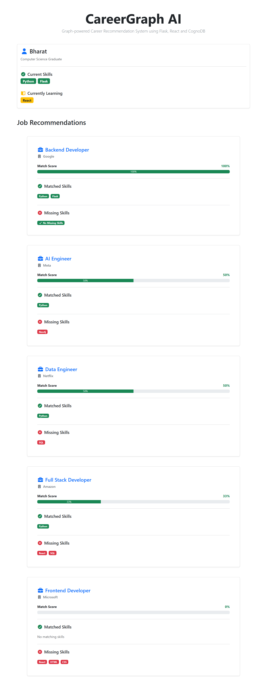
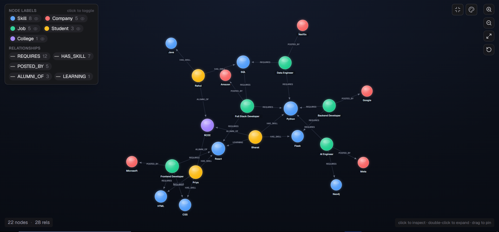
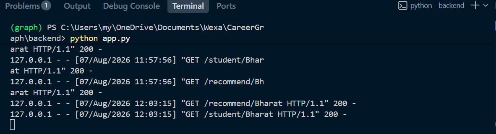

# CareerGraph AI

A graph-powered career recommendation system built using **Flask**, **React**, and **CognoDB (Neo4j-compatible)**.

The application analyzes a student's skills, compares them with job requirements stored in a graph database, and recommends the most suitable jobs along with a match score and missing skills.

---

## Features

- Student Profile
- Graph Database using CognoDB
- Job Recommendations
- Match Score Calculation
- Missing Skills Detection
- Responsive React UI
- REST API using Flask

---

## Tech Stack

### Frontend
- React
- Bootstrap 5
- Axios
- Font Awesome

### Backend
- Flask
- Neo4j Python Driver

### Database
- CognoDB (Neo4j Compatible)

---

## Graph Model

The application stores data as a graph.

Student
↓
HAS_SKILL
↓
Skill

Job
↓
REQUIRES
↓
Skill

Job
↓
POSTED_BY
↓
Company

Student
↓
LEARNING
↓
Skill

Student
↓
ALUMNI_OF
↓
College

---

## Recommendation Logic

The backend:

1. Finds all skills owned by the student.
2. Finds required skills for each job.
3. Calculates:

```
Match Score =
Matched Skills / Required Skills × 100
```

4. Returns

- Matching Skills
- Missing Skills
- Match Score

---

## API Endpoints

| Method | Endpoint | Description |
|---------|----------|-------------|
| GET | `/seed` | Seed graph database |
| GET | `/student/<name>` | Student profile |
| GET | `/recommend/<name>` | Job recommendations |

---

## Project Structure

```
CareerGraph
│
├── backend
│   ├── app.py
│   ├── database.py
│   ├── .env
│   └── requirements.txt
│
├── frontend
│   ├── src
│   ├── package.json
│   └── vite.config.js
│
└── README.md
```

---

## Installation

### Backend

```bash
cd backend

python -m venv graph

graph\Scripts\activate

pip install -r requirements.txt

python app.py
```

### Frontend

```bash
cd frontend

npm install

npm run dev
```

---

## Screenshots

### Home Page



### Graph Database



### Backend



---

## Future Improvements

- User Authentication
- Dynamic Student Registration
- Resume Upload
- Skill Gap Analysis
- AI-powered Learning Recommendations
- Company Search
- Job Filtering

---

## Live Demo

https://careergraph-ai-dusky.vercel.app/

## Screen Recording

https://drive.google.com/file/d/1Z5b39NTGC6fW5yBGM_mTZPLCW1cijnmD/view?usp=sharing

## Author

**Bharat**

Built as part of the Wexa.ai Full Stack Assessment.